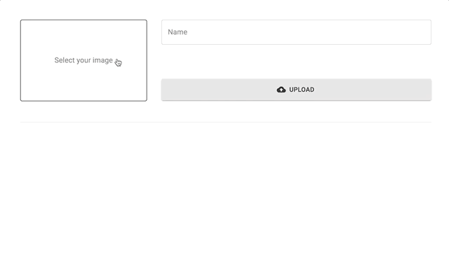

# nestjs-apollo-file-upload-sample

> Sample repository that implements file upload with NestJS and Apollo



## Running app

```bash
$ yarn install
$ yarn workspace server start:dev # Listen on 3000
$ yarn workspace client start # Listen on 8080
```

## Environment variables

```
AWS_S3_BUCKET_NAME=YOUR_BUCKET_NAME
AWS_REGION=YOUR_REGION
PORT=8080
```
